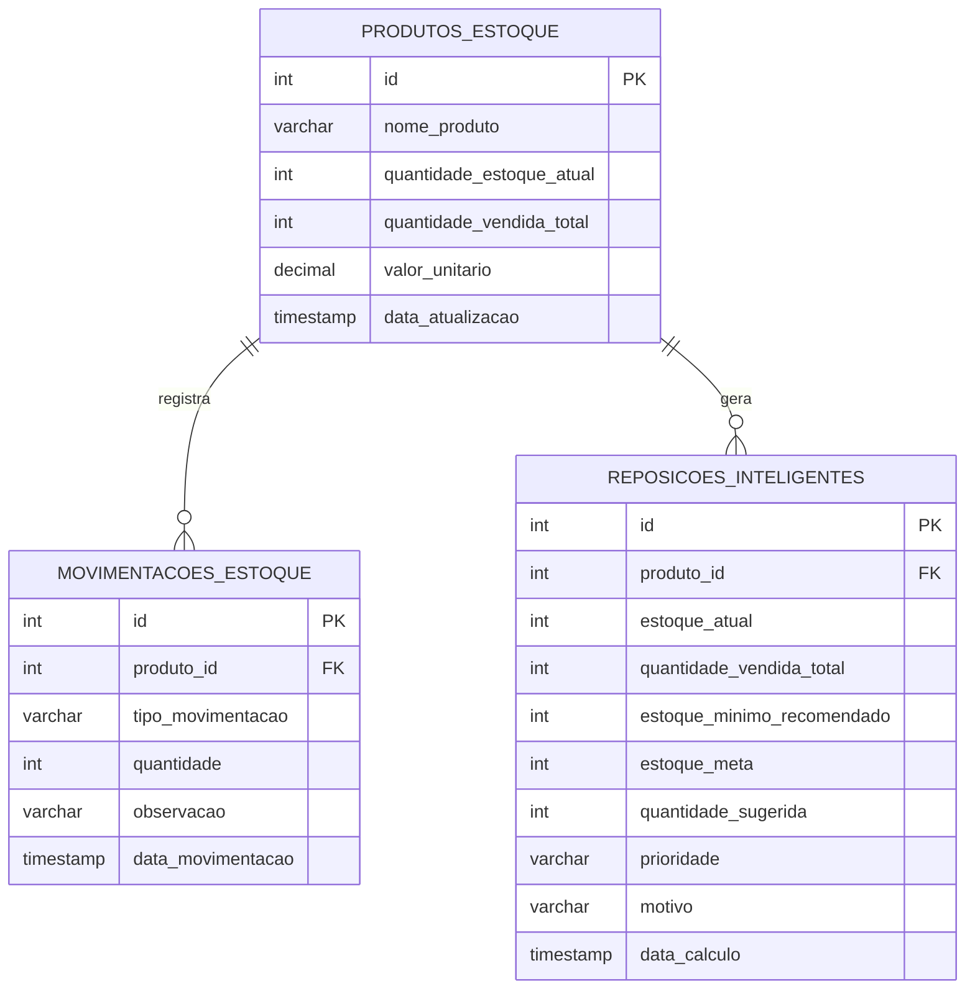

# Modelo de Dados Lógico — Parte Final

## Leitura do modelo

- **PRODUTOS_ESTOQUE**: entidade principal do sistema.
- **MOVIMENTACOES_ESTOQUE**: histórico operacional das entradas e saídas.
- **REPOSICOES_INTELIGENTES**: sugestões de compra calculadas a partir do estoque e das vendas acumuladas.

